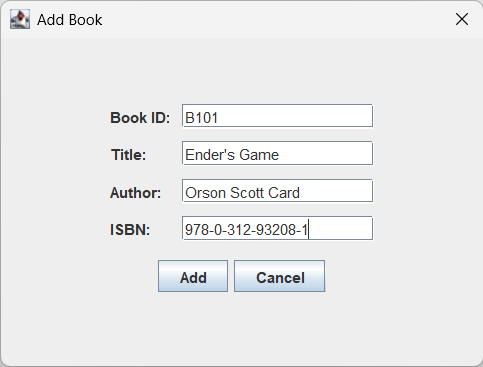

# Library Management System with Book Borrowing

A desktop-based Library Management System implemented in Java Swing. This project demonstrates the design of a basic GUI application capable of managing books and members, with features for borrowing and returning books. The system also implements and improves search and sorting algorithms as part of its core logic.

---

## 📚 Project Overview
The Library Management System allows users to:
- Add and manage library books.
- Add and manage members.
- Borrow and return books.
- Sort and search through the catalog using different algorithms.
- Compare the performance between  base and improved algorithms.

This version does not use a SQL database. All data are stored through file handling.

---

## 👥 Team Members and Roles
| Name | Role |
|------|------|
| Kiera Aguiadan | File Handling / Database Designer  |
| Franciene Candare | System Analyst |
| Marc Garata | UI Designer |
| Emmanuel Tuling | Documentation & Testing Lead |
| Sam Ugmad | Algorithm Specialist |

---

## 🧩 Features
- Add, view, and remove books
- Add, view, and remove members
- Borrow and return books
- Sorting: Quick Sort → Improved Quick Sort (Median-of-Medians Pivot)
- Searching: Binary Search → Optimized Binary Search (isSorted Flag)
- Algorithm performance comparison (timing results displayed)

---

## ⚙️ How to Run the Project
1. Clone the repository:
   ```bash
   git clone https://github.com/sgmad/LibraryManagementSystem.git
   ```
2. Open the project in your preferred IDE (e.g., NetBeans, IntelliJ IDEA).
3. Run the `LibraryManagementSystem.java` file.

**Application Flow:**
1. Launch the system.
2. Login window for authentication. (User: User | Pass: 123)
3. (Optional) Add members and books to populate the list.
4. Use the Borrow feature to lend a book to a member.
5. Use the Return feature to mark a book as returned.
6. Experiment with sorting and searching functions.
7. Use the Compare Algorithms option to see performance improvements.

---

## 🧠 Algorithm Design
| Algorithm Type | Base Implementation | Improved Implementation | Expected Time Complexity Change |
|----------------|---------------------|--------------------------|--------------------------------|
| Searching | Binary Search | isSortedFlag and Cached Sort | O(n log n) → O(log n) after initial search |
| Sorting | Quick Sort | Median-of-Medians + Insertion Sort | O(n²) → O(n log n) |

---

## 🖼️ Screenshots
Screenshots are stored in the `/screenshots` folder.

| Panel | Description | Screenshot |
|--------|--------------|-------------|
| Login Page | Starting page for authentication |  |
| Dashboard | Main navigation area 

Displays all stored books |  |
| Add Book | Interface for adding new books |  |
| Borrow Book | Process of borrowing a book |  |
| Return Book | Marking a book as returned |  |
| Compare Algorithms | Displays comparison results |  |

---

## 🧪 Testing and Evaluation
The system was tested to ensure all major features (adding, searching, sorting, borrowing, returning) function correctly. Algorithm improvements were benchmarked using sample datasets to measure changes in execution time.

---

## 🚀 Possible / Future Enhancements
- Integrate SQL database for persistent storage.
- Add fine management and overdue notifications.
- Implement user authentication with roles (admin, librarian, member).
- Include barcode scanning for book identification.

---

## 📝 License
This project is developed for academic purposes under the University of Mindanao, College of Computing Education.

